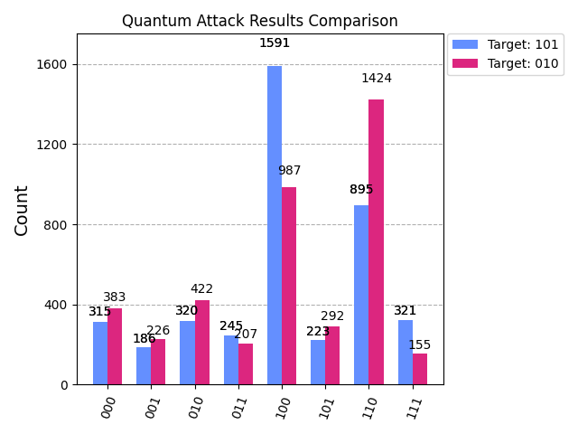

# Measuring Quantum Preimage Attacks: Classical vs. Quantum-Native Hashing

This project provides an experimental framework for evaluating the security of two hashing paradigms **Classical-Style logic** and **Quantum-Native entanglement** against a preimage attack based on **Grover's Algorithm**.

By executing these attacks on the IBM **Heron-class** hardware, the circuit depth and success probability is quantified to analyse how different hashing structures influence vulnerability to quantum cryptanalysis.
 
---

## Overview

The core of this research is a "Quantum Preimage Attack." I attempt to find the original input (preimage) that produces a specific target hash. 

### Comparisons:
*   **Classical Hashing**: Constructed using reversible versions of classical gates (CNOT, Toffoli).
*   **Quantum Hashing**: Built using rotations and entanglement, leveraging natural quantum states.

---

## Findings

### 1. Hardware Paradox
The experimental data reveals a significant trade-off in resource allocation. While the Quantum-Native hash uses gates that are more "natural" for the quantum hardware, the entanglement required for high diffusion leads to **greater circuit depth** (11 layers for quantum hash vs 9 layers for the classical-style hash).

### 2. Successful Preimage Identification
The Grover Search successfully converged on the correct preimages despite hardware noise.

| Target Hash | Identified Preimage | Peak Count (on `ibm_fez`) |
| :--- | :--- | :--- |
| **101** | `100` | 1,361 hits |

| Target Hash | Identified Preimage | Peak Count (on `ibm_marrakesh`) |
| :--- | :--- | :--- |
| **010** | `110` | 1,446 hits |

The results showed a clear Signal-to-Noise Ratio, proving that Heron-class processors can maintain high fidelity even at the depths required for Grover iterations.

---

## Results

Below is the comparison of the execution results for the two target preimages. Note the distinct spikes at the correct bitstrings compared to the "noise floor" of the incorrect states.

### Mathematical Verification
Using a statevector simulator, I confirmed that the Quantum-Native design uses **Probabilistic Mapping**. 
*   Unlike classical one-to-one mapping, input `100` results in a superposition where **101 and 010** are the most likely hashes (32.01% each).
*   This "One-to-Many" mapping makes reverse-engineering significantly more complex for classical systems, as a whole statevector must be reconstructed.

| Hash Output (Bitstring) | Probability |
| :--- | :--- |
| **101** | **32.01%** |
| **010** | **32.01%** |
| 000 | 10.67% |
| 111 | 10.67% |
| 011 | 5.49% |
| 100 | 5.49% |
| 110 | 1.83% |
| 001 | 1.83% |

---

## Circuit Analysis

| Metric | Classical Hash | Quantum Native |
| :--- | :--- | :--- |
| **Attack Depth** | 9 | 11 |
| **Gate Complexity** | High (Toffoli-heavy) | Moderate (CNOT-heavy) |

---
